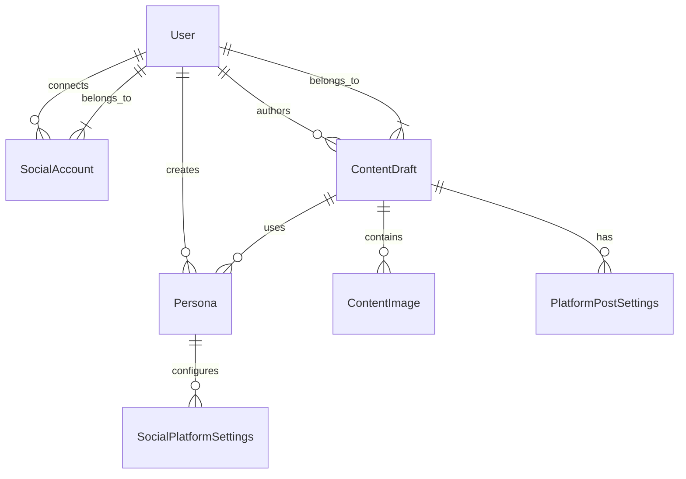
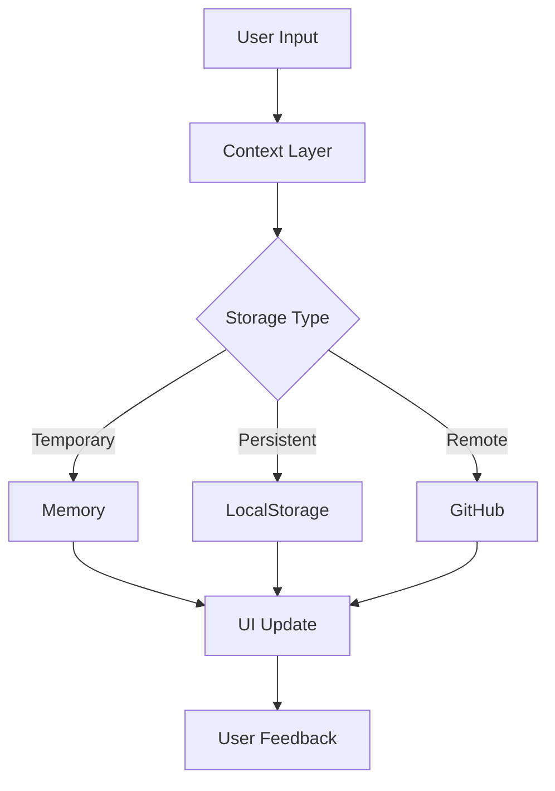

# Ubikial Architecture

## Overview

Ubikial is a React-based web application for managing social media content across multiple platforms. The architecture follows a modular, component-based design with clear separation of concerns.

## Core Technologies

- **Frontend**: React + TypeScript + Vite
- **UI Framework**: TailwindCSS
- **State Management**: React Context + Local Storage
- **AI Integration**: Mistral AI / Custom AI Providers
- **Authentication**: JWT + OAuth2
- **Storage**: GitHub API + LocalStorage fallback

## Directory Structure

## Entities

List of entities

## Relationship

Link between entities

## Model Schema

Graph of entity/relationships.

## Data Schema

### Core Entities

1. **User**
   ```typescript
   interface User {
     id: string;
     email: string;
     displayName: string;
     avatarUrl?: string;
     createdAt: string;
     updatedAt: string;
   }
   ```

2. **Persona**
   ```typescript
   interface Persona {
     id: string;
     name: string;
     description?: string;
     tone?: string;
     style?: string;
     voice?: string;
     platforms: SocialPlatformSettings[];
     githubRepo?: string;
     githubUrl?: string;
     createdAt: string;
     updatedAt: string;
     userId: string;
   }
   ```

3. **SocialAccount**
   ```typescript
   interface SocialAccount {
     id: string;
     platform: SocialPlatform;
     profileId: string;
     profileName: string;
     profileImage?: string;
     accessToken: string;
     refreshToken?: string;
     connected: boolean;
     status: AccountStatus;
     tokenExpiresAt?: string;
     lastVerified: string;
     createdAt: string;
     updatedAt: string;
     userId: string;
     settings: SocialAccountSettings;
   }
   ```

4. **ContentDraft**
   ```typescript
   interface ContentDraft {
     id: string;
     title?: string;
     text: string;
     html: string;
     images: ContentImage[];
     createdAt: string;
     updatedAt: string;
     lastSaved?: string;
     platformSettings: Record<SocialPlatform, PlatformPostSettings>;
     selectedPersonaIds: Record<SocialPlatform, string | null>;
     status: 'draft' | 'scheduled' | 'published';
     scheduledTime?: string;
     userId: string;
     adaptedContent?: Record<SocialPlatform, string>;
   }
   ```

### Relationships



### Storage Strategy

1. **Local Storage**
   - User preferences and settings
   - Active sessions
   - Content drafts
   - Encrypted social tokens
   - Platform configurations

2. **GitHub Storage**
   - Persona configurations
   - Backup of settings
   - Version control of content
   - Synchronization state

3. **Memory Storage**
   - Current session data
   - Active content drafts
   - AI adaptation results
   - Temporary platform states

### Data Flow



### Security Considerations

1. **Token Storage**
   - Access tokens encrypted at rest
   - Refresh tokens stored separately
   - Token rotation on access
   - Secure token transmission

2. **User Data**
   - Personal data minimization
   - Data encryption in storage
   - Clear data lifecycles
   - Regular data cleanup

3. **Platform Access**
   - Scoped permissions
   - Token validation
   - Connection monitoring
   - Automatic reconnection

### Schema Validation

1. **Runtime Validation**
   - TypeScript interfaces
   - Schema validation
   - Data sanitization
   - Error boundaries

2. **Storage Validation**
   - Data integrity checks
   - Schema version control
   - Migration strategies
   - Backup validation

### Data Migration

1. **Version Control**
   - Schema versioning
   - Data structure updates
   - Backward compatibility
   - Migration scripts

2. **Backup Strategy**
   - Regular GitHub sync
   - Local backup creation
   - Recovery procedures
   - Data integrity checks
